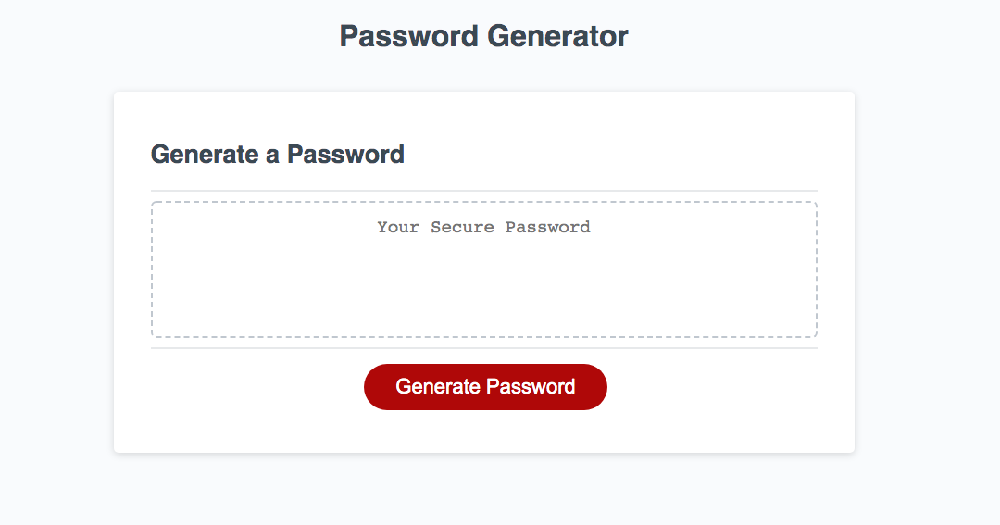
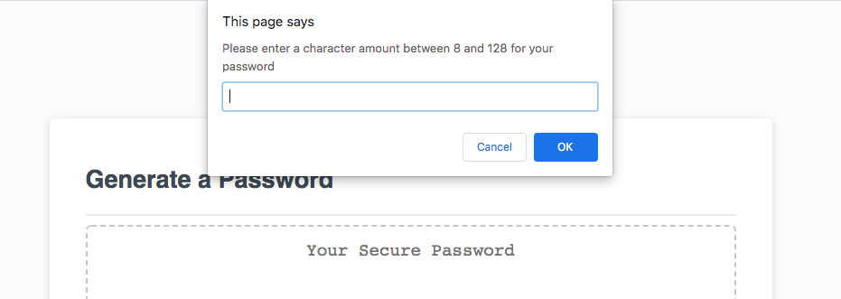
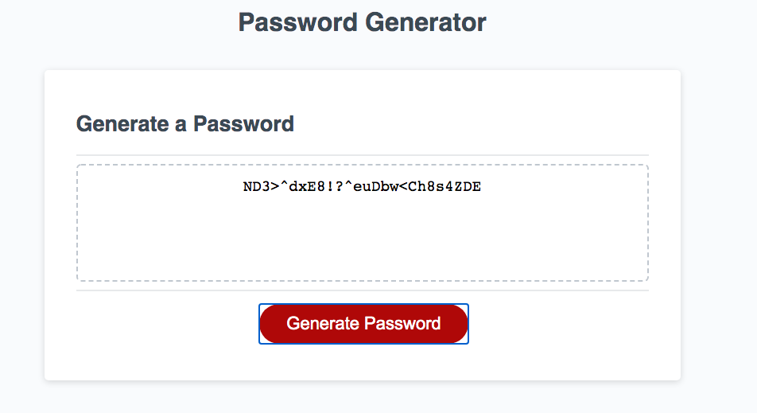

# password-generator

## Description

Based on user's choices of inputs, this JavaScript application will generate a random password that contains lowercase letters, uppercase letters numbers and/or special characters. 

## Links

- [GitHub Repo](https://github.com/CodyBonsma/password-generator/commits/master)
- [Web link](https://codybonsma.github.io/password-generator/)

## Screenshots

*This is the main page for the website*

*once the user clicks 'Generate Password', a series of prompts are given*

*when having received the user's prompts, a random password is generated*

